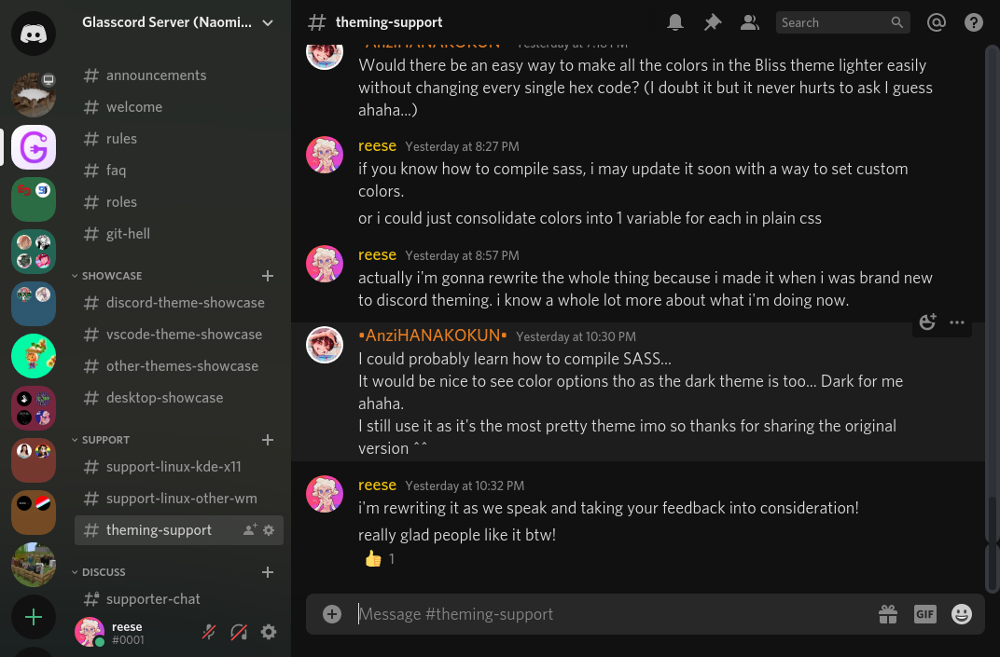
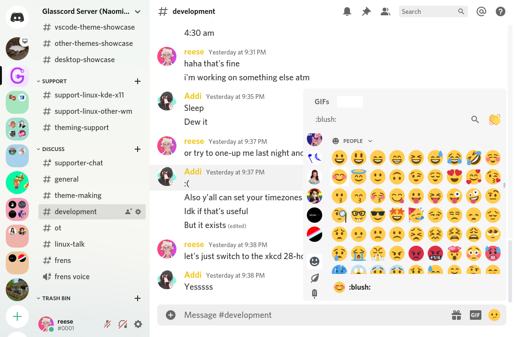

# Bliss *by [katacarbix](https://github.com/katacarbix)*

Sleek, flat theme with support for both light and dark modes. Colors can be modified in the `.theme-dark` and `.theme-light` sections.

Check out the [source repo](https://github.com/katacarbix/discord-themes) where you can find some extras like a Pywal version.

**Licensed under [Apache 2.0](https://github.com/AryToNeX/Glasscord-Themes/blob/master/LICENSE).**
